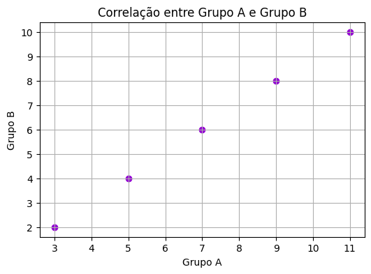

# 📊 Desafios com Dados – Estatística em Python

Este repositório contém a resolução dos desafios avaliativos da disciplina de Estatística Aplicada à Data Science, ministrada pelo professor **Welton Dionísio**, utilizando a linguagem Python no ambiente Google Colab. Os desafios englobam análise de dados, testes estatísticos e visualização gráfica, com entrega estruturada conforme os critérios definidos.

---

## 👩‍💻 Aluna
**Morgana Souza Francisco de Assis**  
Curso: Análise e Desenvolvimento de Sistemas  
Data: 11/04/2025

---

## ✅ Desafios Realizados

### 1. Desafio Obrigatório – Análise de Dados de Vendas
- Criação e leitura do arquivo `vendas.xlsx`
- Tratamento de valores ausentes (mediana para "Vendas", média para "Despesas")
- Agrupamento por Região e Mês
- Combinação horizontal das colunas `Vendas` e `Despesas`
- Geração de sumário estatístico

### 2. Desafio Eletivo 2 – Correlação entre Grupos A e B
- Grupos:
  - Grupo A = [3, 5, 7, 9, 11]
  - Grupo B = [2, 4, 6, 8, 10]
- Cálculo de média, mediana e desvio padrão
- Teste de normalidade com Shapiro-Wilk
- Correlação de Pearson
- Gráfico de dispersão ilustrando a relação entre os grupos

---

## 📈 Visualização dos Gráficos

Abaixo está o gráfico de dispersão gerado no desafio eletivo 2, representando a correlação entre os Grupos A e B:

> O gráfico mostra uma correlação perfeita positiva (r = 1.0) entre os dois grupos, conforme confirmado pela análise estatística de Pearson.

## 📂 Arquivos do Repositório

| Arquivo                                 | ✅ | Descrição                                                   |
|-----------------------------------------|----|-------------------------------------------------------------|
| `vendas.xlsx`                           | ✅ | Arquivo gerado no desafio obrigatório                      |
| `DesafioDataScience.ipynb`              | ✅ | Notebook com todos os códigos (obrigatório + eletivo)      |
| `DesafioDataScience.ipynb - Colab.pdf`  | ✅ | Versão PDF opcional — bom para visualização rápida         |
| `RelatorioEletivo2-Morgana.pdf`         | ✅ | Relatório técnico focado no desafio eletivo 2, muito bem feito |

---

## 🚀 Execute no Google Colab

Você pode abrir este notebook diretamente no Google Colab clicando abaixo:

> Este link abre a versão do notebook hospedada no Google Drive.

---

## 🛠️ Bibliotecas Utilizadas

- `numpy`
- `pandas`
- `scipy.stats`
- `matplotlib`
- `seaborn`

---

## 📄 Relatório Técnico

O relatório completo está disponível no arquivo [`RelatorioEletivo2-Morgana.pdf`](./RelatorioEletivo2-Morgana.pdf), contendo:
- Hipóteses
- Metodologia
- Resultados estatísticos
- Referências bibliográficas
- Link para o notebook

---

## ❗ Declaração de Originalidade

Declaro que este trabalho foi realizado por mim, Morgana, de forma individual e original, 
sem utilização de cópias não autorizadas de fontes externas ou auxílio indevido. 
Estou ciente de que o plágio acadêmico é uma infração grave e que este projeto
será submetido às normas de avaliação da instituição de ensino.

---

## 🧾 Direitos Autorais

© 2025 Morgana Souza. Todos os direitos reservados.

Este projeto foi desenvolvido como parte de uma atividade acadêmica e está licenciado sob os termos da [Creative Commons Atribuição-NãoComercial-CompartilhaIgual 4.0 Internacional (CC BY-NC-SA 4.0)](https://creativecommons.org/licenses/by-nc-sa/4.0/deed.pt-br).

Você tem permissão para:
- Compartilhar (copiar e redistribuir o material em qualquer formato)
- Adaptar (remixar, transformar e criar a partir do material)

**Desde que:**
- Seja atribuído o devido crédito à autora (Morgana Souza)
- O uso não seja para fins comerciais
- As criações derivadas mantenham a mesma licença

> Feito com 💜 por Morgana Souza – 2025  
> Licença: CC BY-NC-SA 4.0
